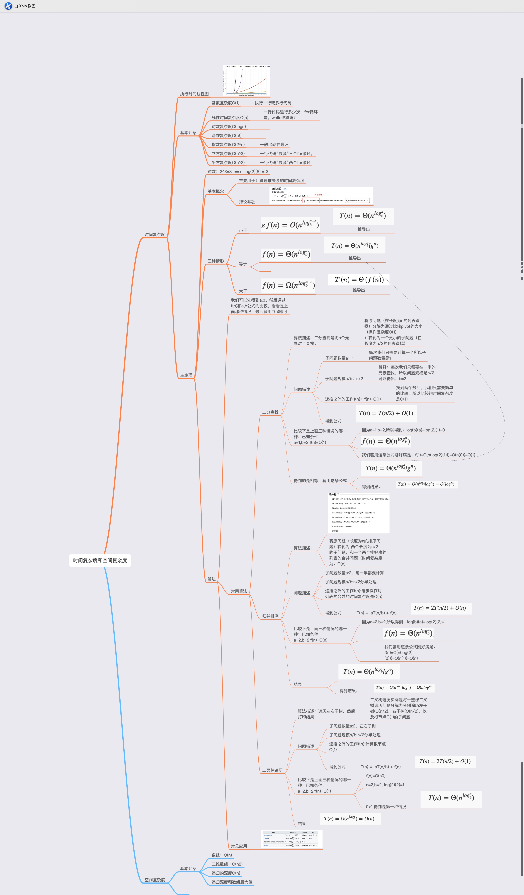
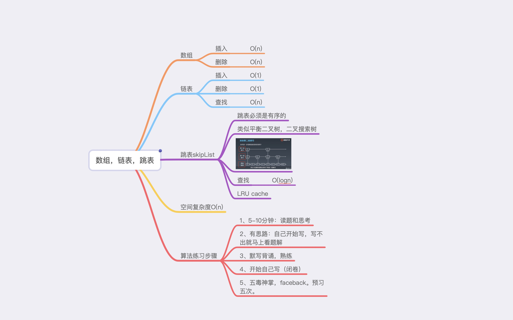

学习笔记

### 递归思路分析

因为计算机最基本的逻辑就是if-else, for, while等等，无论多复杂的代码最后都转换成最基本的逻辑。

而递归思想，其实就类似于for，while循环，递归本身就是循环。

所以我们只需要找到每一次递归的操作即可，就是找最小重复子问题。

举个例子：比如爬楼梯

 当我们枚举全部爬楼梯的可能时，可以从中总结出某些思路，

当爬第一级，就是返回1

当爬第二级，也就是两种可能，2

当爬第三级，换个思路想，第三级的楼梯要么是从第一级上来，要么从第二级上来，所以f(3) = f(2) + f(1)

当爬第四级，f(4) = f(3) + f(2)

...

其实到这里，我们基本上可以发现其中的重复性了，不难得出：f(n) = f(n-1) + f(n-2)

### 嵌套循环，左右夹逼

### 时间复杂度分析：

### 数组，链表，跳表

