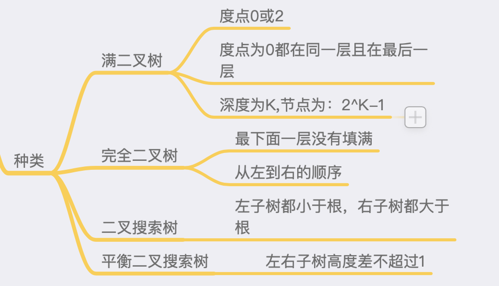
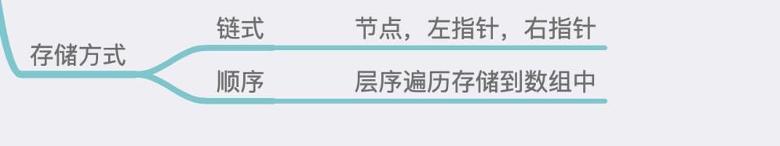
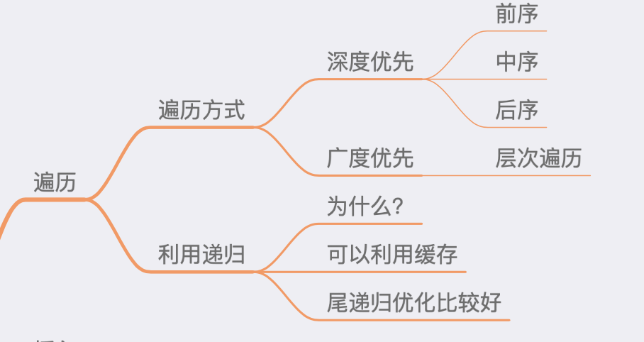

## 二叉树理论基础

### 二叉树种类



### 树的存储方式：



### 遍历方式




### 基本写法

```c++
struct TreeNode {
	int val;
	TreeNode *left;
	TreeNode *right;
	TreeNode(int x): val(x),Left(NULL),right(NULL){}
}
```


### 二叉树

二叉树和跳表的关联

树和图的差别是有没有环

树的二维状态更符合人类的思维习惯

二叉搜索树：左子树<根<右子树

删除操作，左子树最大的一个替换根节点


### 堆

heap:在一堆数中找到最大值和最小值的数据结构，堆有很多种。

二叉堆：通过完全二叉树来实现，（如果用二叉搜索树实现的话，就是logN的）

大顶堆：根节点大于其左右儿子

小顶堆：根节点小于其左右儿子

插入操作：直接插入尾部，然后向上交换

删除操作：把尾部替换根部，然后向下交换


