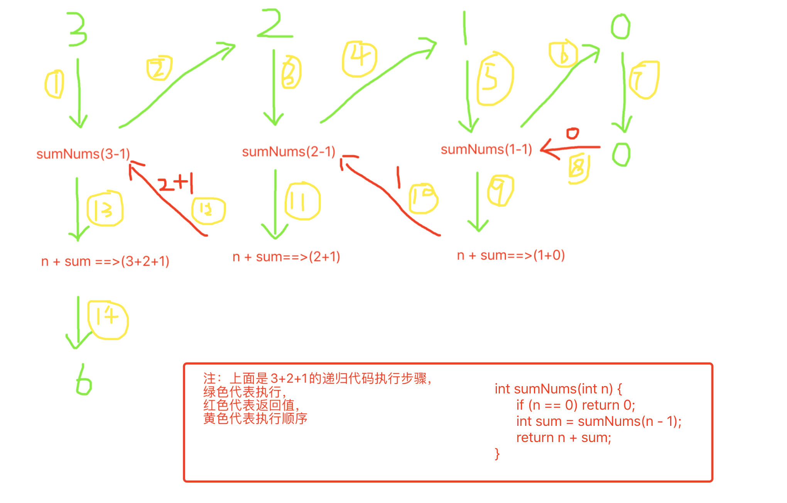

### 弄懂二叉树递归遍历

递归是什么？递归的调用栈是怎样的？我们先从简单的一层递归调用代码，来看下递归是怎么执行的。

#### 求1+2+3+...+n

```
int sumNums(int n) {
	if (n == 0) return 0;
	int sum = sumNums(n - 1);
	return n + sum;
}
```

#### 画出代码执行图



从上图我们可以看到，当执行到sumNums(3-1)时，代码又重新调用自己，并保存sumNum(3-1)的调用栈。

到最后输入是0，判断是0，然后返回，这时应该返回到sumNums(1-1)所处的调用栈，


#### 最大深度，最小深度，节点个数

这几个属于同一类型的题目

先用递归思想分析：三步法

1、传入参数和返回值

传入的是根节点，返回的是个数，或者是深度（Int）

` Int getDepth(TreeNode *root) `

2、确定终止条件

根节点位NULL,返回0

` if (!root) return 0; `

3、当前层逻辑

取左子树总数，取右子树总数，然后计算总结果。

相当于自底向上递归


