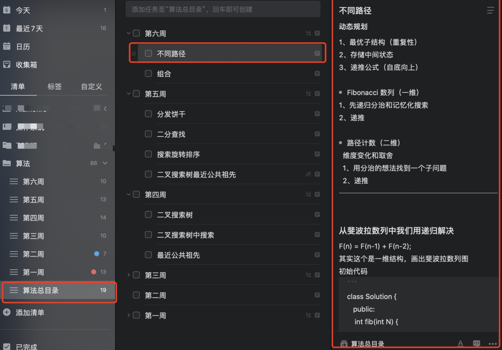

# 如何制定学习计划

我的方法很笨，那就是设置提醒功能，因为我不相信自己能够很自觉的去做算法题，而提醒软件能够帮我列出今天要完成的任务。

我用的是嘀嗒清单，你们也可以找其他类似的提醒软件。下面是我的规划。

1、算法总目录，记录的是每周要学习的算法，以及相应的路径
2、每周下面添加子任务，子任务记录的是自己对该道算法的感悟
3、单独抽出每一周的算法练习题，并且为每天的算法加上时间提醒。
4、建议用vsCode编辑器，我会保存每周做过的题目，这样可以看到你写过的代码，增加成就感。

